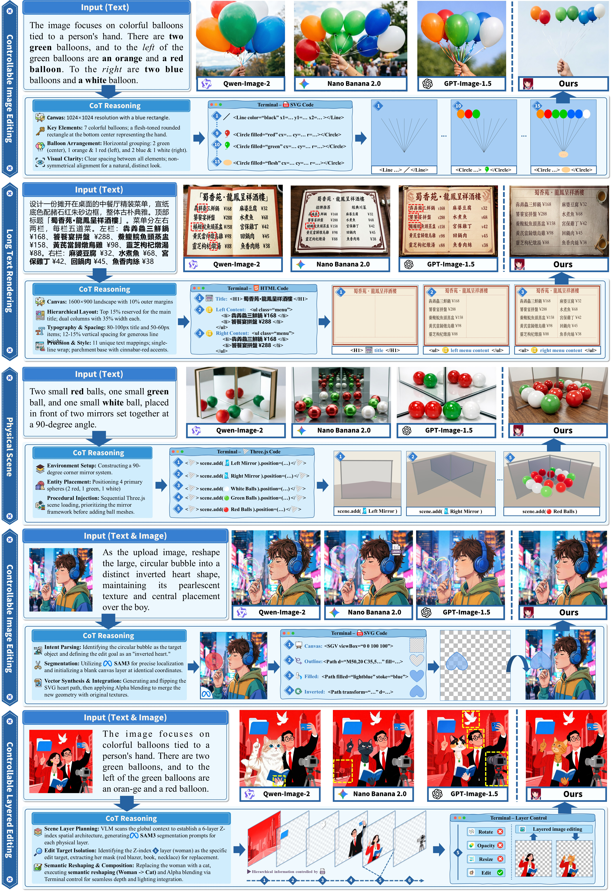
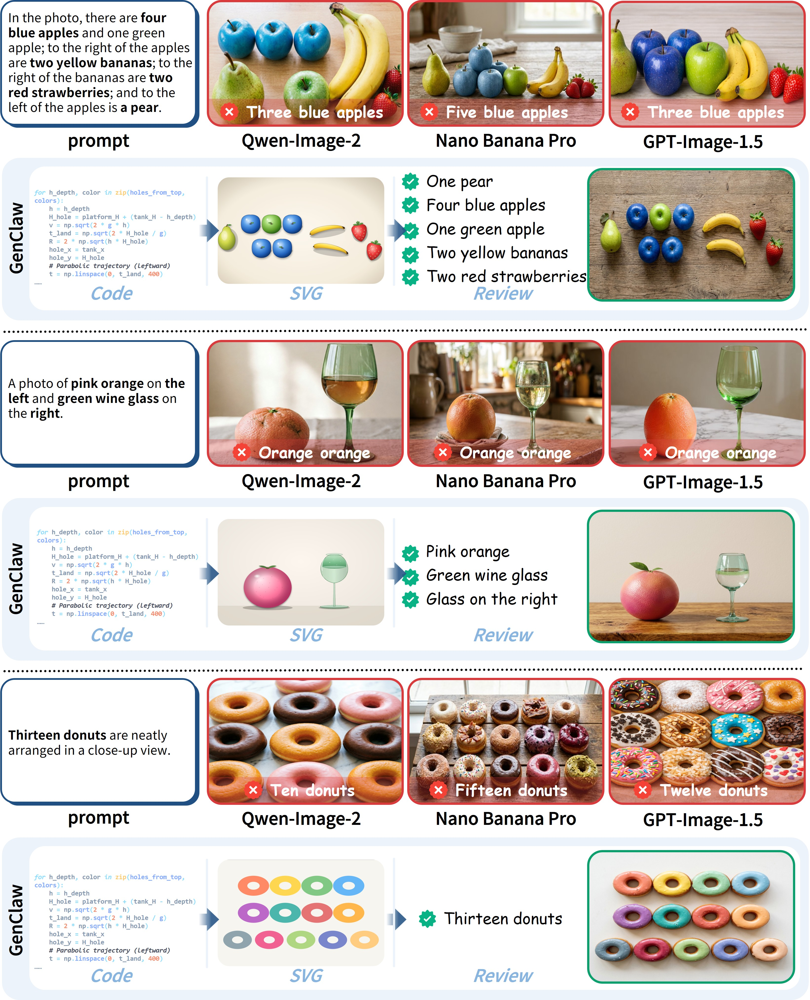
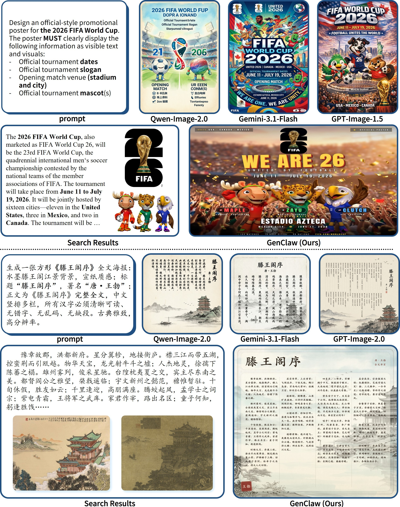
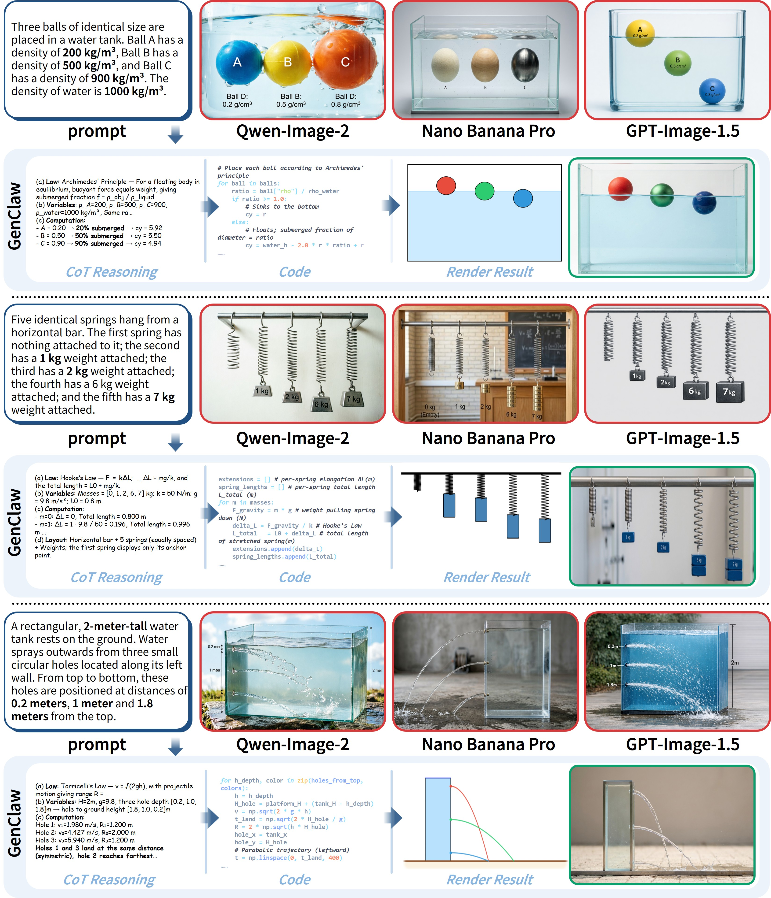
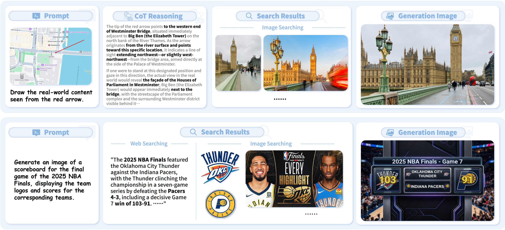

# GenClaw: Code-Driven Agentic Image Generation

[](https://huggingface.co/papers/2605.30248)
[](https://arxiv.org/abs/2605.30248)
[](https://github.com/yejy53/GenClaw)

GenClaw explores **code-driven agentic image generation**: instead of only rewriting prompts, an image generation agent uses code as a controllable visual canvas before calling image generation models for final rendering.

The core idea is simple: **think, sketch with code, then render**.

<p align="center">
  
</p>

## Highlights

- **Code as a visual brush.** The agent writes executable visual sketches, such as SVG, HTML/CSS, Python, or lightweight 3D code, to make layout and structure explicit.
- **More controllable generation.** Object counts, spatial relations, text layout, and layer order can be grounded in code before photorealistic rendering.
- **Transparent intermediate states.** The generation process becomes easier to inspect, debug, and revise than a pure prompt-to-image pipeline.
- **General visual tasks.** GenClaw is designed for complex composition, text rendering, physical reasoning, knowledge-grounded generation, and layered image editing.

## Showcase

<p align="center">
  
</p>

## Visual Examples

### Complex Scene Composition

<p align="center">
  
</p>

### Text Rendering and Poster Design

<p align="center">
  
</p>

### Physical Reasoning

<p align="center">
  
</p>

### Knowledge-Grounded Generation

<p align="center">
  
</p>

## Status

The technical report is available now. Code and demos are being prepared and will be released later.

## Links

- Paper: https://huggingface.co/papers/2605.30248
- arXiv: https://arxiv.org/abs/2605.30248
- Repository: https://github.com/yejy53/GenClaw

If you find this project interesting, please consider giving it a star and voting for the paper on Hugging Face.

## Citation

If you find GenClaw useful, please consider citing our technical report:

```bibtex
@article{ye2026genclaw,
  title={GenClaw: Code-Driven Agentic Image Generation},
  author={Ye, Junyan and others},
  journal={arXiv preprint arXiv:2605.30248},
  year={2026}
}
```
